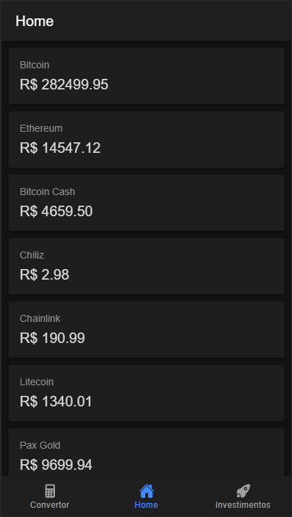

# Bitcoin App

Este aplicativo é um sistema desenvolvido com Ionic Framework com o objetivo de ser um aplicativo de acompanhamento de cotação de cryptomoedas.

## Instalação

Para realizar a instalação, precisamos rodar "npm install" para fazer a instalação das dependências.

```bash
npm install
```

Com todas as dependências instaladas, podemos inicializar o aplicativo com o comando "ionic serve"

```bash
ionic serve
```

## Preview


